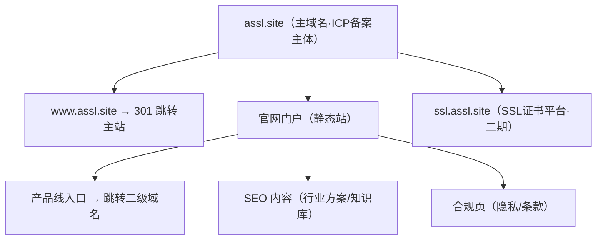

# 公司官网门户完整规划（assl.site）

## 背景与决策
- 主域名 `assl.site`（`www.assl.site` 与 `assl.site` 同站，www 做 301 跳转到裸域或反之一致化）。
- 品牌定位：泛科技/网络安全服务公司门户，SSL 证书平台是第一个产品线，未来可扩展其他产品线。
- 域名 `assl.site` 与 SSL 天然契合（a SSL site），品牌叙事中作为强记忆点，但公司业务不限于证书。
- 品牌名未定：占位用 "ASSL"（直接取自域名，过渡期用），公司中文名确定后改 `src/data/site.ts` 一处即可全站生效。
- 技术栈：Astro 静态站 + TypeScript + TailwindCSS。Node v24.15.0 / npm 11.12.1 已确认。
- 备案：`.site` 属于可备案新顶级域，多数省份支持；正式备案前先完成开发，再走接入商备案流程。

## 域名与备案架构



- 备案主体落在 `assl.site`，证书平台 `ssl.assl.site` 随主域名备案后直接启用，无需单独备案。
- 官网纯静态，开发期不依赖备案；上线可用香港/海外节点先行，备案通过后切大陆。

## 项目结构
```text
e:\code\jia-gw
├── src/
│   ├── layouts/BaseLayout.astro   # 全局布局：Header/Nav/Footer + SEO head
│   ├── components/                # Hero、ProductCard、SolutionCard、CTASection 等
│   ├── pages/
│   │   ├── index.astro            # 首页（核心）
│   │   ├── about.astro            # 关于我们
│   │   ├── contact.astro          # 联系我们
│   │   ├── products/
│   │   │   └── ssl.astro          # SSL 证书产品线介绍页
│   │   └── legal/
│   │       ├── privacy.astro      # 隐私政策（上线合规必需）
│   │       └── terms.astro        # 服务条款（占位框架）
│   ├── data/
│   │   └── site.ts                # 站点配置单一来源：公司名/域名/备案号/联系方式/产品线
│   └── styles/global.css
├── public/
│   ├── favicon.svg
│   └── robots.txt
├── astro.config.mjs               # 输出静态 dist/，trailingSlash 规范化
├── tsconfig.json
└── package.json
```

## 页面与内容规划

### 首页 index.astro
- Hero：公司定位一句话（占位："面向企业的可信网络安全与基础服务提供商"）+ 主 CTA（进入 SSL 证书平台）
- 产品线区：SSL 证书平台主卡片（跳 `ssl.assl.site`，未部署前放占位外链），2-3 个"即将推出"占位卡片
- 解决方案区：按行业（电商/金融/教育/政企）占位文案
- 为什么选择我们：快速签发 / 专业支持 / 稳定可靠
- 底部：ICP 备案号占位（`京ICP备XXXXXXXX号` 格式）+ 联系方式

### 关于我们 about.astro
- 公司介绍（占位）、发展历程时间线框架、资质栏（营业执照等，备案后补充）

### 联系我们 contact.astro
- 电话/邮箱/地址占位 + 表单占位（静态站用 mailto 提交，不接后端）

### 产品线页 products/ssl.astro
- SSL 证书平台完整介绍：DV/OV/EV 对比表、签发流程、为什么选我们
- 购买 CTA 跳 `ssl.assl.site`
- 该页同时承担 SEO 内容（证书科普）起点

### 合规页 legal/privacy.astro、legal/terms.astro
- 隐私政策 + 服务条款，占位框架（上线合规必需，备案审核也可能查看）

## 关键实现点
- 全部可变信息（公司名/域名/备案号/联系方式/产品线外链）集中在 `src/data/site.ts`，一处修改全局生效，品牌定名时零成本替换
- BaseLayout 统一管理 title/description/OG/结构化数据，SEO 基础一次到位
- 静态部署产物 `dist/`，可丢 Nginx / 对象存储 + CDN，无服务端依赖
- 响应式：移动端导航（汉堡菜单）、卡片流式布局

## 实施步骤
1. 初始化 Astro 项目（最小模板）+ TailwindCSS + TypeScript
2. 搭建 BaseLayout（Header/Nav/Footer + SEO head）与 site.ts 配置
3. 编写核心组件（Hero/ProductCard/SolutionCard/CTA）
4. 实现首页（Hero/产品线/方案/优势/底部备案）
5. 实现关于我们、联系我们、SSL 产品页、合规页
6. 本地验证：`npm run dev` 各页渲染、响应式、无报错；`npm run build` 通过

## 风险与待确认
- `.site` 备案：多数省份可行，个别省份管局对境外注册商域名审核可能有差异，以接入商备案系统实际支持为准（不阻塞开发）
- 证书平台 `ssl.assl.site` 属二期，本次仅做官网入口页与占位外链
- 品牌中文名确认后替换 site.ts 一处即可