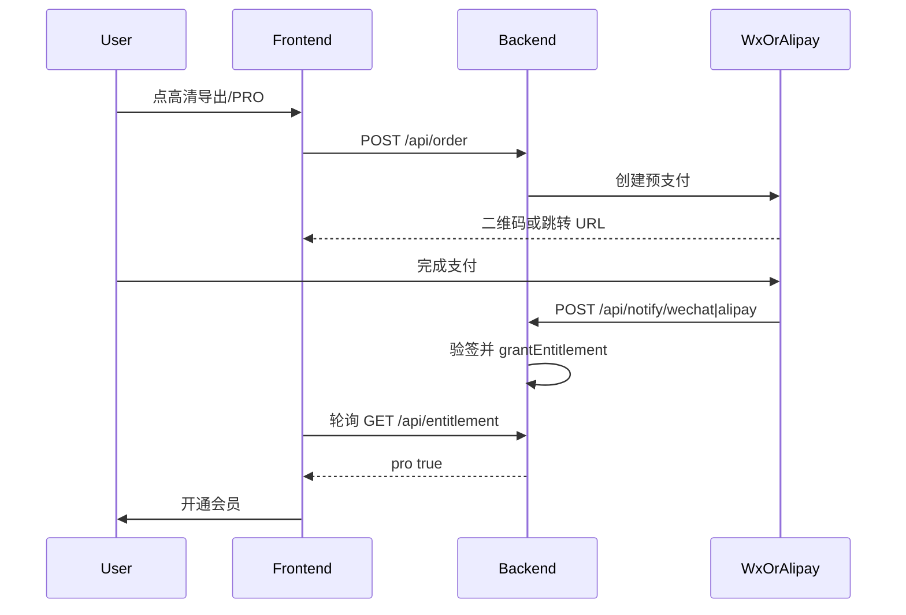

# 微信/支付宝官方收费 + 公网部署落地计划

## 现状

收费逻辑已写好，无需重写支付核心：

- 前端收银台：[src/components/Paywall.tsx](src/components/Paywall.tsx) 可选微信扫码 / 支付宝跳转，支付后轮询 `/api/entitlement`
- 后端：[server/src/index.js](server/src/index.js) 下单 → 验签回调 → `markPaid` → `grantEntitlement`
- Provider：[server/src/providers/wechat.js](server/src/providers/wechat.js)（Native 扫码）、[server/src/providers/alipay.js](server/src/providers/alipay.js)（WAP 跳转）
- 前端按订单传入 `provider`，可同时开微信+支付宝；`PAY_PROVIDER` 只影响默认值与是否显示「演示支付」

当前阻塞：**无公网 HTTPS 回调地址**、**未填商户密钥**、**生产存储未定稿**（SQLite 改动在工作区未提交）。

## 架构选择（已定）

采用**腾讯云轻量应用服务器同机部署**（不拆 EdgeOne Pages 前后端分离，避免 CORS 与双域名备案复杂度）：

- Nginx：静态托管 `dist/`，反代 `/api`、`/mock-pay` → Node `8787`
- Node Express：`DB_MODE=sqlite`，`BASE_URL=https://你的域名`
- 域名 + HTTPS（Let's Encrypt）+ **大陆节点需 ICP 备案**（微信/支付宝回调与国内访问的常规要求）

## 阶段 0：资质准备（你在控制台完成，无代码）

并行申请，通常数天到数周：

| 事项 | 用途 |
|------|------|
| 营业执照 + 对公账户 | 商户入驻 |
| 微信支付商户号 + 关联 AppID | Native 扫码 |
| 商户 API 证书 / 序列号 / APIv3 密钥 / 平台证书 | 签名与验签 |
| 支付宝开放平台应用 + 签约手机网站支付 | WAP 跳转 |
| 应用私钥 + 支付宝公钥 | 签名与验签 |
| 域名 + 备案 + 服务器 | 回调 URL 必须公网 HTTPS |

沙箱可先联调支付宝；微信正式环境一般需真实商户。

## 阶段 1：生产化后端（代码侧）

1. **定稿 SQLite 存储**：完成并验证工作区中 [server/src/db.js](server/src/db.js)、[server/src/store.js](server/src/store.js)（订单/权益持久化；账号仍用现有 `users.json` 即可，单机足够）。
2. **生产环境变量模板**：扩展 [server/.env.example](server/.env.example)，明确生产必填项：
   - `PAY_PROVIDER=wechat`（关闭演示支付；用户仍可在收银台选支付宝）
   - `BASE_URL=https://your.domain`
   - `DB_MODE=sqlite`
   - 全套 `WX_*` / `ALIPAY_*`
   - `ALIPAY_RETURN_URL=https://your.domain/`
3. **小改进（可靠性）**：`/api/config` 返回已配置渠道列表（根据密钥是否齐全），Paywall 对未配置渠道禁用按钮，避免「选了支付宝却报未配置」。
4. **部署产物**：新增 `deploy/` 下 Nginx 站点配置示例 + systemd 单元（`zhengzhaoxia.service` 启动 `node server/src/index.js`），以及简短 `DEPLOY.md`（构建、上传、证书、环境变量步骤）。

## 阶段 2：服务器部署步骤

1. 购买腾讯云轻量（建议 2 核 / 4G，系统 Ubuntu 22.04）。
2. 安装 Node 20+、Nginx、certbot；开放 80/443。
3. 代码拉取后：
   - `pnpm install && pnpm build`（前端）
   - `cd server && pnpm install`（含 `better-sqlite3` 需本机构建工具）
4. 写入 `server/.env`（密钥仅放服务器，不进 Git）。
5. 配置 Nginx：`/` → `dist`，`/api/` → `127.0.0.1:8787`；`try_files` 支持 SPA。
6. 申请证书：`certbot --nginx -d your.domain`。
7. 启用 systemd，确认 `curl https://your.domain/api/config` 返回非 mock。

## 阶段 3：商户控制台配置

**微信**：

- 产品：Native 支付
- 支付回调：`https://your.domain/api/notify/wechat`（与代码中 `notifyPath` 一致）
- 将商户号、AppID、证书序列号、私钥、APIv3 密钥、平台证书填入 `.env`

**支付宝**：

- 签约：手机网站支付
- 授权回调/网关可访问；异步通知：`https://your.domain/api/notify/alipay`
- 填入 `ALIPAY_APP_ID`、应用私钥、支付宝公钥、`ALIPAY_RETURN_URL`

## 阶段 4：联调验收

1. 打开站点 → 上传照片 → 点「高清导出」→ **不应再出现「演示支付」**。
2. 微信：生成二维码 → 真机扫码付 0.01 测（或正式价）→ 后台日志看到 notify → 页面约 2s 内开通会员。
3. 支付宝：跳转收银台 → 支付成功 → 回跳站点 → 轮询开通。
4. 刷新页面 / 换浏览器（已登录账号）→ 会员仍在（SQLite + 账号绑定）。
5. 回归：`pnpm test`、`pnpm test:server`（mock 集成测仍可本地跑）。

## 不在本次范围

- EdgeOne Pages 拆分部署、聚合支付、微信 OAuth/短信真实网关（收费闭环不依赖它们）。
- 多实例 / PostgreSQL（单机 SQLite 足够 MVP；日订单量大再迁库）。

## 关键风险

- **备案与商户审核周期**长于代码改造；可先用 mock 在已部署域名上验 Nginx/反代，商户批下来再改 `PAY_PROVIDER` 与密钥。
- `better-sqlite3` 必须在目标机器安装/编译，部署文档需写明 `build-essential`。
- 支付宝当前为 WAP（`alipay.trade.wap.pay`）；桌面浏览器体验一般，后续可按 UA 切 `page.pay`，首版可接受。
